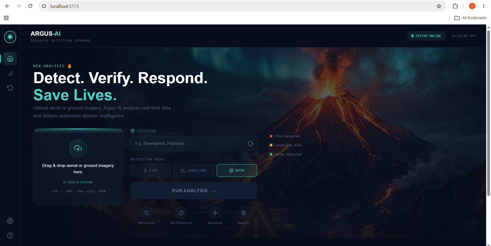
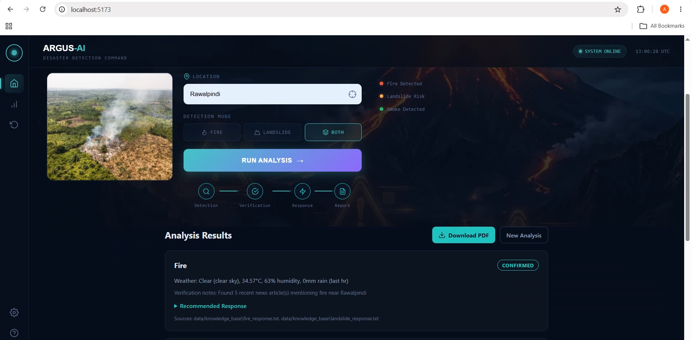
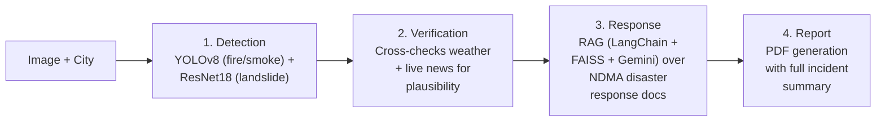

# Argus-AI

**Disaster & Threat Detection Command Center** — an AI system that detects fire/smoke and landslide risk from aerial or ground imagery, cross-verifies alerts against live weather and news data, and generates an actionable response plan with a downloadable incident report.

> Built to close the gap between raw detection and a decision-ready alert: a model saying "fire, 92% confidence" isn't useful to a responder — knowing whether it's *plausible*, what the weather's doing, and what to do next, is.





---

## The Problem

Disaster detection models are everywhere — fire detectors, flood classifiers, landslide segmenters. Almost none of them answer the question a responder actually has: **"Is this real, and what do I do about it?"** Raw confidence scores don't verify against real-world context, and don't hand off to a next step. Argus-AI wraps detection in a verification + response layer so a single image produces a usable field advisory, not just a label.

---

## How It Works

A four-agent pipeline, orchestrated with LangGraph:



1. **Detection Agent** — YOLOv8 for fire/smoke, a ResNet18 classifier for landslide terrain. Both run on every uploaded image.
2. **Verification Agent** — Pulls live weather (rain, temperature, condition) and recent local news for the given city, and checks whether the detection is *plausible* given that context — e.g. a landslide alert with zero recent rain gets flagged for manual review rather than auto-confirmed.
3. **Response Agent** — A RAG pipeline (LangChain + FAISS + Gemini) retrieves relevant sections from NDMA Pakistan disaster-response protocol documents and generates a tailored action plan: immediate actions, recommended response tier, and key safety considerations.
4. **Report Agent** — Compiles everything into a clean, shareable PDF incident report.

A built-in **mutual suppression gate** handles the case where fire and landslide are both flagged on the same image (a known failure mode — see [Limitations](#known-limitations)) by deciding final status through verification plausibility, not raw model confidence.

---

## Tech Stack

`Python` `PyTorch` `YOLOv8` `LangGraph` `LangChain` `FAISS` `Gemini API` `FastAPI` `React` `Vite` `Tailwind CSS`

---

## Model Results

**Fire/Smoke Detection (YOLOv8n)** — trained on the D-Fire dataset

| Metric | Score |
|---|---|
| mAP50 | 0.758 |
| mAP50-95 | 0.439 |
| Smoke mAP50 | 0.822 |
| Fire mAP50 | 0.695 |

**Landslide Classification (ResNet18)** — trained on the Bijie Landslide Dataset

| Metric | Score |
|---|---|
| Validation Accuracy | 98.8% |
| Weighted F1 | 0.99 |
| Landslide Precision / Recall / F1 | 0.97 / 0.99 / 0.98 |
| Non-Landslide Precision / Recall / F1 | 1.00 / 0.99 / 0.99 |

---

## Known Limitations

Being upfront about where the current models fall short:

- **Fire → landslide false positive**: The landslide classifier occasionally misreads burn scars and bare soil in fire photos as landslide terrain, sometimes at very high confidence. The mutual-suppression gate in the Verification Agent catches most of these by checking rainfall data before confirming a landslide alert.
- **Wide-shot landslide misses**: The landslide classifier performs well on tight, zoomed-in shots of a slide scar (matching its training data) but is less reliable on wide aerial shots where the scar is a smaller part of the frame with surrounding village/road context.

These are documented rather than hidden because they reflect a real, common failure mode in small-dataset CV models — and the verification layer exists specifically to catch cases like this rather than trusting raw confidence scores.

---

## Running Locally

**Backend**

```bash
cd src
uvicorn api:app --reload
```

Runs at `http://127.0.0.1:8000` — Swagger docs at `/docs`.

**Frontend**

```bash
cd frontend
npm install
npm run dev
```

Runs at `http://localhost:5173`, proxies `/api` requests to the backend.

You'll need a `.env` with your own Gemini API key and news/weather API keys — see `.env.example`.

## Roadmap / Future Work

- Grad-CAM explainability heatmaps for detection results
- Broader disaster type coverage (flood, once a cleaner dataset is available)
- Live deployment (currently local-only — see limitations on free container hosting in 2026)